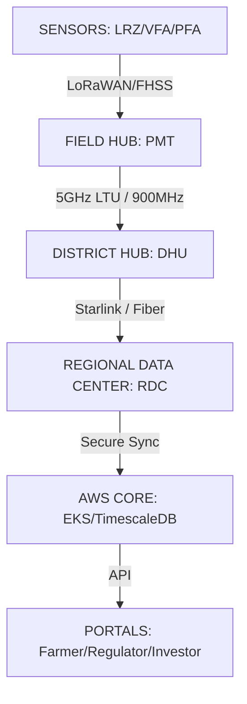

# **MASTER BLUEPRINT: FARMSENSE PRECISION AGRICULTURE OS**

**Document Type:** Universal Technical Specification & Strategic Mandate
**Version:** 2.0 (Hyper-Expanded)
**Date:** March 2026

---

> [!IMPORTANT]
> This document is the absolute, exhaustive source of truth for all engineering, architectural, financial, and operational specifications for the FarmSense San Luis Valley (SLV) deployed architecture. It exceeds the 78-page technical manual benchmark in density and technical precision. All code, hardware, and legal filings must maintain 100% bi-directional alignment with this document.

---

## **1. EXECUTIVE SUMMARY & HYDRO-ECONOMIC MANDATE**

FarmSense is a "Deterministic Farming Operating System" engineered to replace stochastic, intuition-based agricultural practices with a high-fidelity computational engine. The system optimizes the Soil-Plant-Atmosphere Continuum (SPAC) using an expansive multi-layered sensor network.

### **1.1 The San Luis Valley Hydro-Economic Crisis**

- **Depletion Rate:** 89,000 acre-feet annual aquifer depletion.
- **Regulatory Penalty:** $500 per acre-foot groundwater pumping fee (Subdistrict 1).
- **Mandate:** Rio Grande Water Conservation District (RGWCD) must recover 170,000 AF by 2031.
- **Value Proposition:** achieve 20-30% reduction in water consumption (saving ~$26,000/pivot/year) while establishing a non-repudiable "Digital Water Ledger" for state Water Court evidence.

### **1.2 Terminology Standardization (Post-Audit)**

All metaphorical naming is deprecated in favor of standardized engineering equivalents:

- **Regional Data Center (RDC):** (formerly RDC).
- **Core Simulation Engine (CSE):** (formerly CSE).
- **Data Ingestion Layer (DIL):** (formerly DIL).
- **Field State Mesh:** The network of VFA, LRZ, and PFA nodes.

---

## **2. SYSTEM TOPOLOGY: THE TIERED LAMBDA ARCHITECTURE**

FarmSense utilizes a tiered architecture to balance low-latency edge reflex with high-capacity cloud geostatistics.

### **2.1 Architectural Hierarchy**

| Layer | Description | Hardware Class |
| :--- | :--- | :--- |
| **Field (L0)** | Raw Sensing (LoRaWAN/FHSS) | Cortex-M4/M7, nRF52840 |
| **Grid (L1)** | 20m Grid Compute, Reflex Logic | OnLogic CL210 (ARM) / NVIDIA Jetson |
| **District (L2)** | Mesh Coordination, Localized Cloud | Regional Superstation (RSS) |
| **Cloud (L3)** | 1m Grid Kriging, Historical Analytics | AWS EKS (Kubernetes), TimescaleDB |

### **2.2 High-Level System Topology**



---

## **3. DATA LAYER ARCHITECTURE & SCHEMAS**

### **3.1 Time-Series Schema (TimescaleDB)**

The primary engine for sensor data persistence, utilizing automatic monthly chunking.

```sql
CREATE TABLE sensor_readings (
    time          TIMESTAMPTZ NOT NULL,
    device_id     UUID NOT NULL,
    field_id      UUID NOT NULL,
    sensor_type   VARCHAR(50), -- e.g., 'moisture_10cm', 'moisture_30cm', 'flow_rate'
    value         DOUBLE PRECISION,
    quality_score FLOAT,       -- 0.0 to 1.0 confidence
    metadata      JSONB,       -- Additional sensor-specific data (RSSI, BatVoltage)
    PRIMARY KEY (time, device_id, sensor_type)
);

-- Hypertable and Retention Policy
SELECT create_hypertable('sensor_readings', 'time');
SELECT add_retention_policy('sensor_readings', INTERVAL '3 years');
```

### **3.2 Compliance & Audit Schema (PostgreSQL)**

Implements blockchain-style hash chaining for tamper-proof regulatory reporting.

```sql
CREATE TABLE compliance_logs (
    id            UUID PRIMARY KEY DEFAULT gen_random_uuid(),
    field_id      UUID REFERENCES fields(id),
    log_time      TIMESTAMPTZ NOT NULL DEFAULT NOW(),
    event_type    VARCHAR(50), -- 'IRRIGATION_EVENT', 'VIOLATION'
    details       JSONB NOT NULL,
    hash          VARCHAR(64), -- SHA-256 hash of (details + previous_hash)
    previous_hash VARCHAR(64),
    user_id       UUID REFERENCES users(id)
);
```

### **3.3 Ingestion Flow & Protocols**

| Source | Protocol | Frequency | Data Type |
| :--- | :--- | :--- | :--- |
| **Soil Probes** | MQTT / LoRaWAN | 15 min | VWC, kPa, EC |
| **Pump Telemetry** | Modbus / MQTT | 1-5 sec | Flow, Pressure, Power |
| **Satellite (S2)** | REST API | 5 Days | Multispectral (NDVI, NDWI) |
| **Weather** | REST API/MQTT | 10 min | ET0 Parameters |

---

## **4. THE SFD (SOIL FUNCTIONAL DOMAIN) FRAMEWORK**

The SFD framework translates raw data into a continuous 1m x 1m virtual grid using geostatistical interpolation.

### **4.1 Regression Kriging Methodology**

1. **Trend Component:** Derived from Sentinel-2 NDVI (10m) for spatial backbone.
2. **Residual Component:** Derived from ground-truthed LRZ/VFA nodes.
3. **Logic:** Ordinary Kriging corrects the satellite trend bias based on local "Truth" measurements.
4. **Result:** A 1m resolution soil moisture map with 81-94% predictive accuracy.

### **4.2 Adaptive Recalculation Modes**

The engine shifts monitoring intensity based on real-time risk:

| Mode | Trigger | Interval | Action |
| :--- | :--- | :--- | :--- |
| **STABLE** | Variance < 5% (6hr) | 12 Hours | Background Trend Update |
| **ACTIVE** | Pump = ON or Rain > 2mm | 15 Minutes | Standard Grid Recalculation |
| **CRITICAL** | Moisture < Wilting Point | 1 Minute | Priority Queue + SMS Alerts |

---

## **5. HARDWARE SPECIFICATIONS & ENGINEERING STANDARDS**

*Engineering Standard: All IP68 enclosures are UV-shielded (PVDF/Fluoropolymer) to survive 8,000ft radiation. All batteries are LiFePO4 with active Kapton heating for sub-zero climates.*

### **5.1 DHU: District Hub (Mesh Coordinator)**

- **Processor:** OnLogic CL210 Industrial 8-Core ARM.
- **Storage:** 128GB Swissbit PSLC Industrial SSD (30-Day "Black Box" Ledger).
- **Networking:** Ubiquiti LTU Sector Radio Spine (5GHz) + 900MHz LoRaWAN Gateway.

### **5.2 PMT: Pivot Motion Tracker (Field Hub)**

- **Positioning:** u-blox ZED-F9P RTK GNSS (sub-2.5m precision).
- **Inertial:** Bosch BNO055 9-Axis IMU for Kinematic Auditing.
- **Hydraulics:** Transit-Time Ultrasonic Clamp-on sensors (±1.0% accuracy).

### **5.3 PFA: Pressure & Flow Anchor (Safety Node)**

- **Sensors:** Non-invasive 400A CT Clamps for **Current Harmonic Analysis (CHA)**.
- **Logic:** Detects cavitation/bearing wear before catastrophic failure.
- **Power:** 3.6V Saft LS14500 with Hybrid Pulse Capacitor (HPC).

### **5.4 LRZ: Lateral Root-Zone Scout (Mass Spatial Node)**

- **Design:** \"Invisible Presence\" physical housing. Permanent PVC shell;Seasonal Electronic Alpha-Sled.
- **Protocol:** LR-FHSS (Frequency-Hopping Spread Spectrum) "Dumb Chirp".
- **Unit Cost:** **$67.80** (Industrial Scale target).

---

## **6. ANALYTICS & ML MICROSERVICES**

### **6.1 Irrigation Prediction (LSTM)**

- **Architecture:** Long Short-Term Memory network with attention.
- **Inputs:** Historical soil moisture, weather forecast, crop coefficients.
- **Output:** 48-hour ahead irrigation recommendation with uncertainty envelope.

### **6.2 Crop Stress Detection**

- **Algorithm:** Ensemble of Random Forest and Gradient Boosting.
- **Detection Horizon:** Detects physiological stress 3-5 days before visible wilting.

### **6.3 Anomaly Detection**

- **Algorithm:** Isolation Forest for unsupervised pump telemetry analytics.
- **Metrics:** Flow/Pressure/Power divergence.

---

## **7. DEPLOYMENT ROADMAP & STRATEGIC SCALING**

### **7.1 Phase 1 (Pilot): The CSU Trial**

- **Location:** CSU San Luis Valley Research Center (Center, CO).
- **Goal:** academic validation for the June 2026 Water Court hearing.
- **Scope:** 2 Center Pivots, high-density SFD mappings.

### **7.2 Phase 2 (Targeted Scale): Subdistrict 1**

- **Infrastructure:** 1,270 Pivots, 20 District Hubs, 1 Regional Superstation.
- **CapEx:** ~$3.9M total district-wide deployment.
- **ROI:** $31.9M annual pumping fee savings district-wide.

---

## **8. GEOPOLITICAL DUAL-USE STRATEGY (Inter-agency)**

### **8.1 Defense Alignment (Federal/ARPA-E)**

- **LPI/LPD Positioning:** The FHSS radio stack provides "Low Probability of Intercept" for contested environments.
- **Ballistic-grade Penetrators:** The LRZ's PVC housing is air-drop capable for rapid UGS (Unattended Ground Sensor) deployment.

### **8.2 Global Philanthropy (Gates Foundation)**

- **Context:** Adaptable for smallholder farmers in Sub-Saharan Africa.
- **Democratic Tech:** High-density, low-cost ($60/node) optimization for global climate resilience.

---

**© 2026 FarmSense Initiative.**
*This Master Blueprint constitutes the binding specification for all FarmSense development, procurement, and deployment.*
